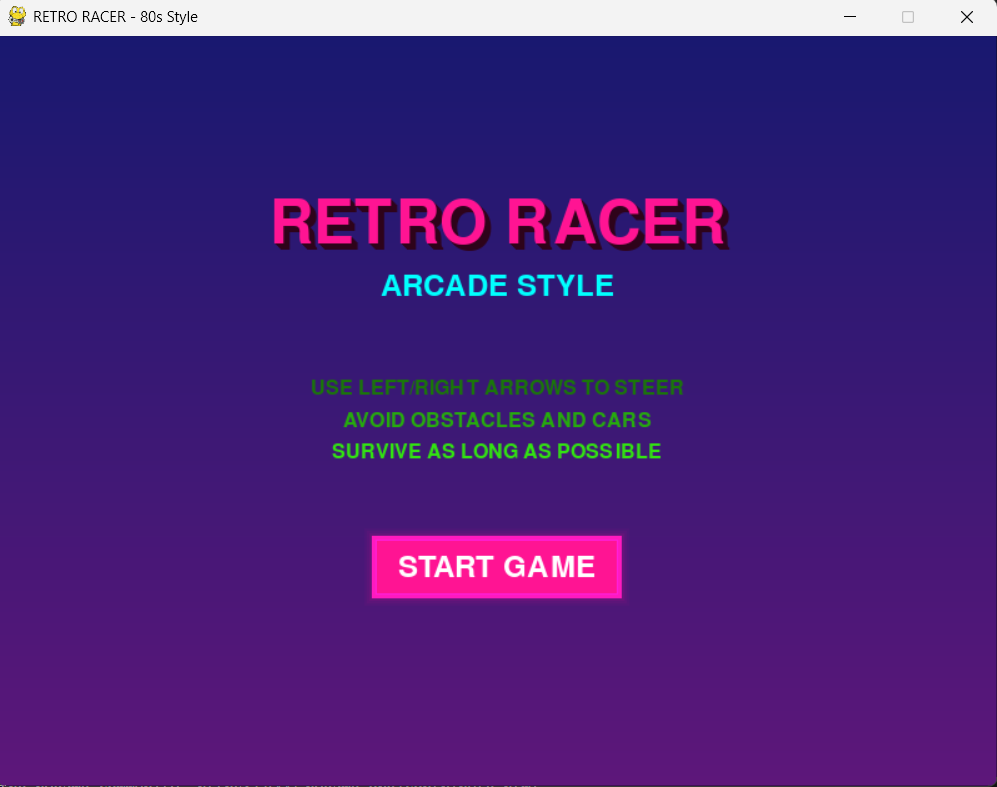
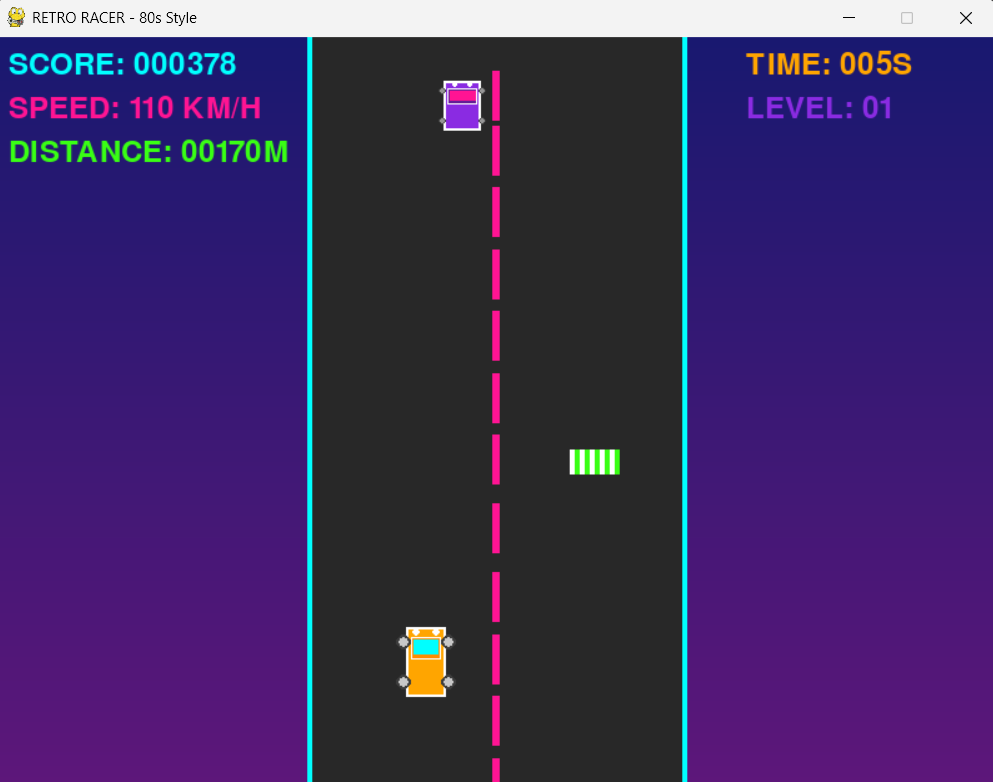

# 🚗 Racing Game — Retro Style (Built with AI Collaboration)

Welcome to the repository of "Racing Game", a retro-inspired arcade racing experience designed and developed with the power of AI-assisted programming. This project showcases how generative AI tools can boost creativity, solve complex problems, and automate repetitive tasks during game development.

## 🎮 Simple Retro Features

### **Clean Visual Design**
- **Simple Gradient Background**: Subtle purple-to-pink gradient
- **Straight Road**: Classic top-down view with cyan borders
- **Clean HUD**: Simple text display for score, speed, distance, time, and level
- **Pixel-Perfect Graphics**: Clean, readable retro styling

### **Retro UI Elements**
- **Chunky Pixel Buttons**: RetroButton class with glow effects
- **Mouse & Keyboard Support**: Click buttons or use traditional keyboard controls
- **Simple Animations**: Clean title effects and button interactions

### 💡 Effective Prompting Techniques Discovered
- Retro pixel-art style with neon roads and 8-bit music
- Accurate logic for side-scrolling 2D racers
- Theme-aligned code and even suggest libraries like pygame and pixel-style spritesheets.
- **Simple Movement**: Straightforward top-down obstacle avoidance with realistic car physics

## 🎯 Gameplay Features

- **Progressive Difficulty**: Speed and obstacle spawn rate increase over time
- **Simple Scoring**: Points for distance traveled and obstacles passed
- **Level System**: Visual level progression
- **Mouse Support**: Full mouse interaction alongside keyboard controls
- **Performance Optimized**: Smooth 60 FPS gameplay

## 🧠 How AI Handled Classic Programming Challenges
- AI provided intelligent solutions to:
- Collision detection (with pixel-perfect accuracy)
- Game loops and frame rate optimization
- Player input lag issues
- Road scrolling effects with seamless texture loops

## Controls

- **Left/Right Arrows**: Steer your car
- **Space**: Start game / Restart after game over
- **Escape**: Quit game (from game over screen)
- **Mouse**: Click buttons for menu navigation

## Installation

1. Make sure you have Python 3.6+ installed
2. Install the required dependencies:
   ```bash
   # Using pip (in virtual environment)
   pip install -r requirements.txt
   
   # Or using system packages (Ubuntu/Debian)
   sudo apt install python3-pygame python3-numpy
   ```

## DEMO



## How to Run

```bash
python3 retro_racer.py
```

## Testing

🛠️  Using tool: execute_bash (trusted)
 ⋮
 ● I will run the following shell command:
```bash
cd "/mnt/d/DevSearch/Python game" && python3 test_features.py
```
 ⋮
 ```
 ↳ Purpose: Test the simplified game features
 ```

Run the feature test to verify all enhancements are working:
```bash
python3 test_features.py
```

## 🛠️ Tech Stack

- Python + Pygame
- AI Tools: ChatGPT for logic/code, DALL·E for pixel art ideas
- Editor: VS Code
- OS: Windows + WSL for Linux compatibility

## 🤝 Contributions & Learning
This project helped me:
Improve real-time game logic and event handling
Practice Python game development in a modular format
Learn how to prompt and collaborate effectively with AI

